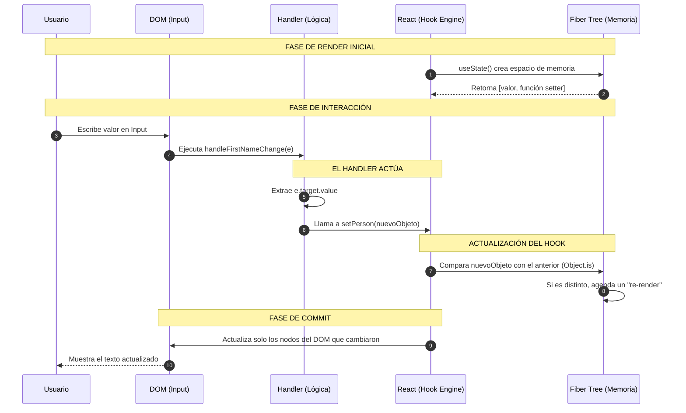

## ¿Quién se encarga de qué? (Roles técnicos en React)

### 1. El Hook (`useState`) — El almacén
**Función:**  
Su responsabilidad es conservar la información entre renderizados. Normalmente, cuando una función finaliza, sus variables se pierden. `useState` le indica a React que debe guardar el estado fuera de la función para que, cuando el componente se ejecute de nuevo, los datos sigan disponibles.

**Detalle técnico:**  
React reconoce cada Hook según el orden en el que se declara. Por este motivo, nunca debe colocarse un `useState` dentro de estructuras condicionales (`if`) o bucles (`for`).

---

### 2. El Handler (`handle...Change`) — El mensajero
**Función:**  
Actúa como intermediario entre el navegador y React. Su tarea es escuchar los eventos del usuario (por ejemplo, pulsaciones de teclado) y decidir qué información se enviará al estado.

**Detalle técnico:**  
Es una función de tipo *callback*. No se ejecuta al cargar la página, sino que permanece a la espera hasta que el DOM lanza un evento.

---

### 3. El Setter (`setPerson`) — El interruptor
**Función:**  
Es la pieza clave del flujo de estado y cumple dos misiones fundamentales:
- Actualizar el valor almacenado en el estado de React.
- Forzar un nuevo renderizado del componente.

Sin esta llamada, React no tendría forma de saber que debe volver a pintar la interfaz.

---

### El “pegamento” del sistema: la inmutabilidad
Cuando se utiliza `...person`, se está creando un nuevo objeto en memoria. Esto es esencial porque React realiza una comparación rápida:

- Si el objeto se modifica directamente (`person.name = 'X'`), la comparación devuelve **true** (misma referencia en memoria) y React no actualiza la vista.
- Si se crea un nuevo objeto usando `{ ... }`, la comparación devuelve **false**, lo que provoca que React actualice la interfaz.

---

### Resumen de responsabilidades

| Pieza | Responsabilidad técnica |
|------|-------------------------|
| Hook | Mantener el estado entre renderizados |
| Handler | Capturar eventos del navegador |
| Setter | Aplicar cambios y forzar el render |
| JSX (`return`) | Definir cómo se representa el estado actual |
