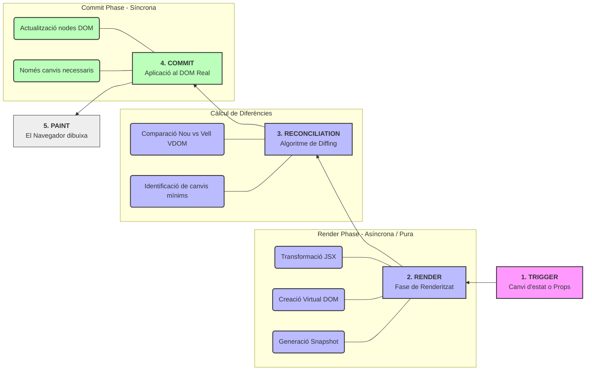
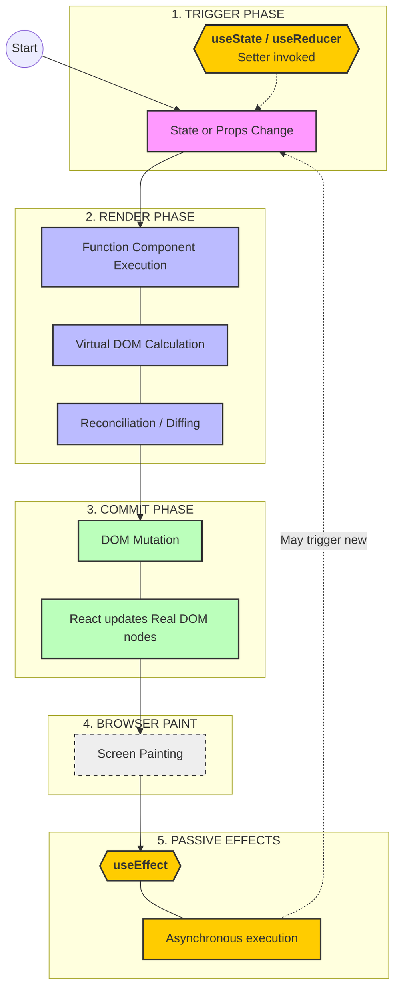

# React Rendering Process: Render and Commit Phases

This document summarizes the internal flow of React from the moment an update is requested until the user sees the changes on the screen.

---

## 1. Trigger Phase (The "Request")
The process starts with a **Trigger**, which notifies React that a component needs to be updated.
* **Initiators:** Usually caused by a state update (`useState` / `useReducer` setters) or changes in `props`.
* **Nature:** This phase is about scheduling the work. React keeps track of which components need to re-render.

## 2. Render Phase (The "Calculation")
In this phase, React determines what has changed. It is **pure** and has no visible side effects.
* **Component Execution:** React calls your function component to determine what the UI should look like based on current state and props.
* **Virtual DOM & Reconciliation:** React generates a new Virtual DOM tree and compares it with the previous one (an algorithm called **Diffing**).
* **Result:** A list of minimal changes (additions, updates, deletions) required to sync the UI.

## 3. Commit Phase (The "Update")
React applies the calculated changes to the browser's Real DOM.
* **Efficiency:** React only modifies the specific DOM nodes that changed. If the output of the Render phase is the same as before, React does nothing here.
* **Synchronous:** This phase is usually synchronous to ensure the UI stays consistent.

## 4. Browser Paint
Once the Real DOM is updated, the browser takes over:
* The browser re-calculates the layout and **paints** the pixels on the screen.
* The user finally sees the updated interface.

## 5. Effects Phase (Post-Paint)
After the browser has painted the screen, React executes side effects.
* **`useEffect`:** These run **asynchronously** after the paint to avoid blocking the UI.
* **Note:** If an effect triggers a new state update, the entire cycle starts again from the **Trigger** phase.

---

### Key Concepts to Remember
* **Render != Painting:** "Rendering" is React calling your function; "Painting" is the browser drawing pixels.
* **Immutability:** React relies on state snapshots. Each render sees a fixed version of state at that point in time.
* **Declarative UI:** You describe *what* the UI should look like (JSX), and React handles the *how* (Commit/Paint).

---

# React Lifecycle: The Render and Commit Phases

# React Lifecycle: The Render and Commit Phases (Hooks, UserState, UserEffect)

