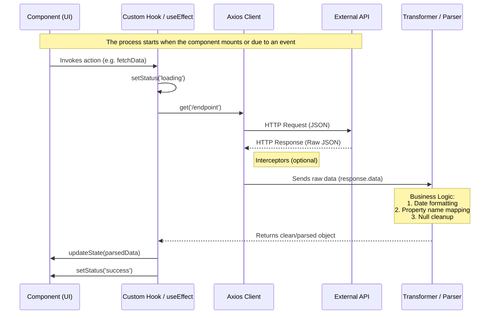
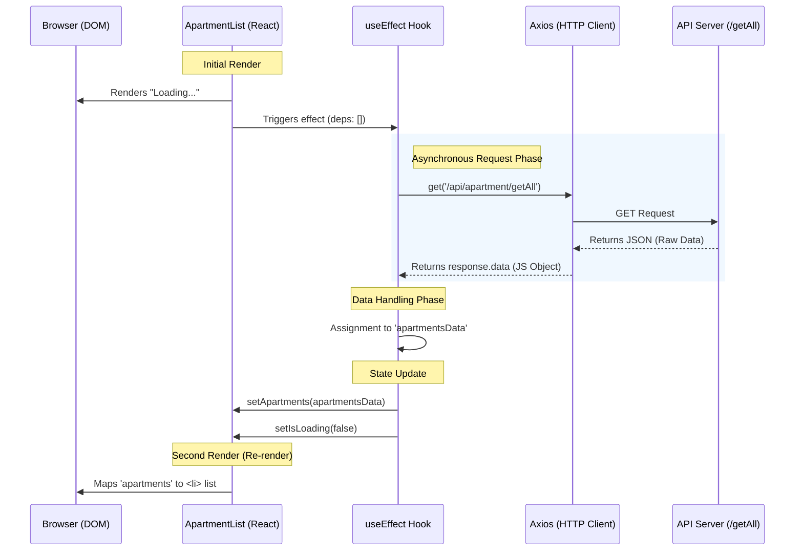

# Data Management Documentation: `ApartmentList` Component

This document describes the information flow, from the asynchronous request to the final render in the React component, explaining how Hooks and the Axios library interact.

## 1. React Data Flow Diagram



---

## 2. Apartment Data Sequence Diagram

The following diagram illustrates the data lifecycle:



---

## 3. Technical Flow Analysis

### A. State Initialization (`useState`)

Three critical states are defined to manage the data lifecycle:

* **`apartments`**: Initialized as an empty array `[]`. This is the final container for the data.
* **`isLoading`**: A boolean that controls the user experience (UX) while data is being fetched over the network.
* **`isAxiosError`**: A flag used for exception handling.

---

### B. Effect Trigger (`useEffect`)

By using an empty dependency array `[]`, the data flow starts exactly once, immediately after the component is mounted to the DOM.

---

### C. Automatic Consumption and Parsing (Axios)

When the API responds, Axios performs the first level of parsing internally:

1. It receives the response body as plain text (JSON).
2. It automatically transforms it into a JavaScript Object Literal.
3. It exposes it through the `response.data` variable.

---

### D. Data Transformation (Data Mapping)

At the line:

```js
const apartmentsData = response.data;
```

the data is ready to be manipulated.

> **Note:** This is the recommended point to apply cleanup or transformation functions if the API property names (e.g. `prefarea`) do not match the desired UI naming conventions (e.g. `isPreferredArea`).

---

### E. Re-rendering and Projection

When `setApartments(apartmentsData)` is executed, React detects a state change and triggers a re-render. During this process:

* The component function runs again.
* The `{isLoading ? ... : ...}` condition changes to display the list.
* The `.map()` method iterates over the new data array, projecting each object into an `<li>` element in the DOM.
