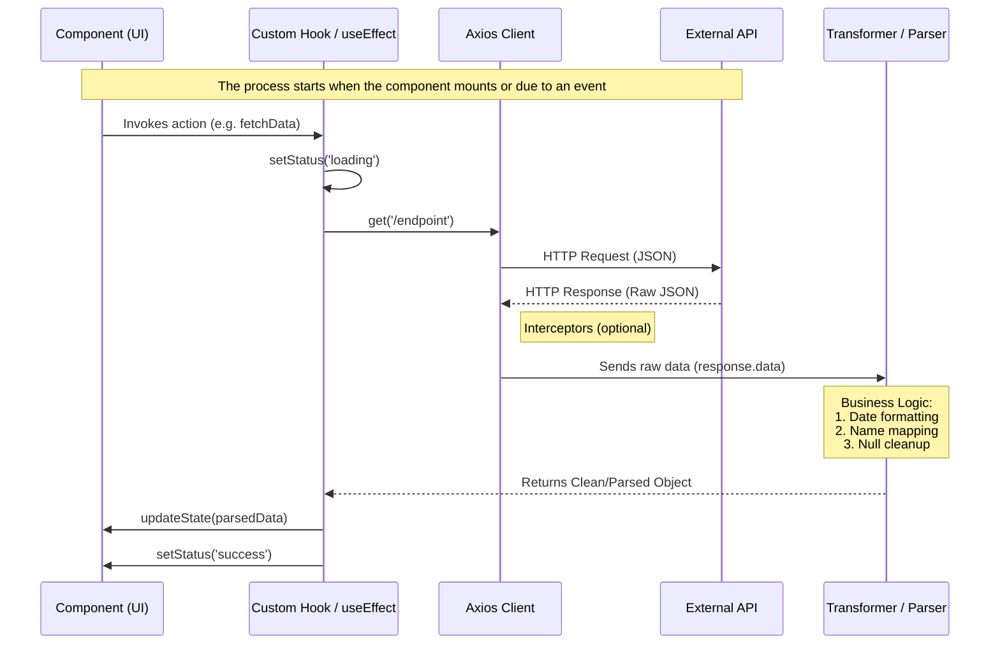
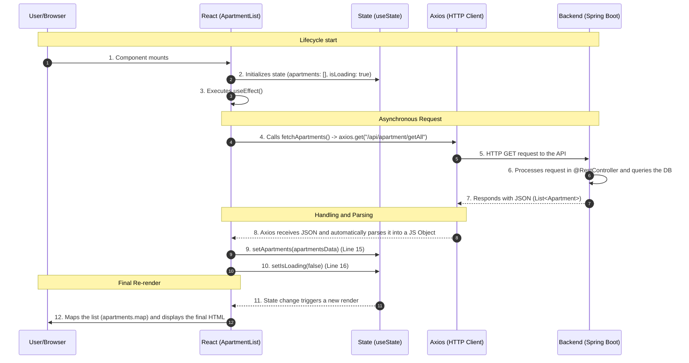

# Data Management Documentation: `ApartmentList` Component

This document details the information flow, from the asynchronous request to the final rendering in the React component, explaining how Hooks and the Axios library interact.

## 1. React Data Flow Diagram



## 2. Apartment Data Sequence Diagram

The following diagram illustrates the data lifecycle:



## 3. Detailed Step-by-Step Explanation

### 1. Initialization and Mounting

When the **`ApartmentList`** component loads, the first thing that happens is the initialization of the Hooks.

* **Lines 5–7**: The initial states are defined.
  `isLoading` starts as `true`, so the user initially sees the **"Loading..."** message on the screen.

---

### 2. Effect Trigger (`useEffect`)

* **Line 9**: The `useEffect` with an empty dependency array `[]` tells React:
  *"Run this code only once, right after the component appears on the screen."*

* **Line 10**: The asynchronous function `fetchApartments()` is defined and immediately invoked.

---

### 3. The HTTP Request (Axios)

* **Line 12**:

  ```js
  axios.get("/api/apartment/getAll")
  ```

  sends a request to the Spring Boot server.

> **Important:** Axios automatically parses the response when the backend returns JSON.
> There is no need to use `JSON.parse()`, as the result is already a JavaScript object accessible via `response.data`.

---

### 4. Backend Handling (Spring Boot)

Although the Java code is not shown, the flow assumes that:

* A **`@RestController`** receives the request at the corresponding endpoint.
* A **Repository** retrieves the data from the database.
* Spring Boot serializes Java objects into JSON format using the **Jackson** library.

---

### 5. State Update and Re-rendering

* **Line 15**:

  ```js
  setApartments(apartmentsData)
  ```

  stores the actual data in the component state.

* **Line 16**:

  ```js
  setIsLoading(false)
  ```

  switches off the loading indicator.

**The trigger:**
In React, every time a state setter (`set...`) is executed, the component automatically re-renders.

---

### 6. Data Transformation to UI (`.map()`)

* **Line 33**: Since `isLoading` is now `false`, React executes the main render block.

* **Line 35**:

  ```js
  apartments.map(...)
  ```

  acts as the rendering engine, iterating over each object in the array and transforming it into an `<li>` element.

* **Line 36**:

  ```jsx
  key={apartment.id}
  ```

  allows React to efficiently track each element when the list changes.

---

### A Key Point About “Parsing”

In this code, the data travels through the following formats:

**DB (SQL/NoSQL)** → **Java Object (POJO)** → **JSON (Text)** → **JS Object** → **DOM (HTML)**

This flow ensures a clear separation between persistence, business logic, data transport, and UI presentation.
