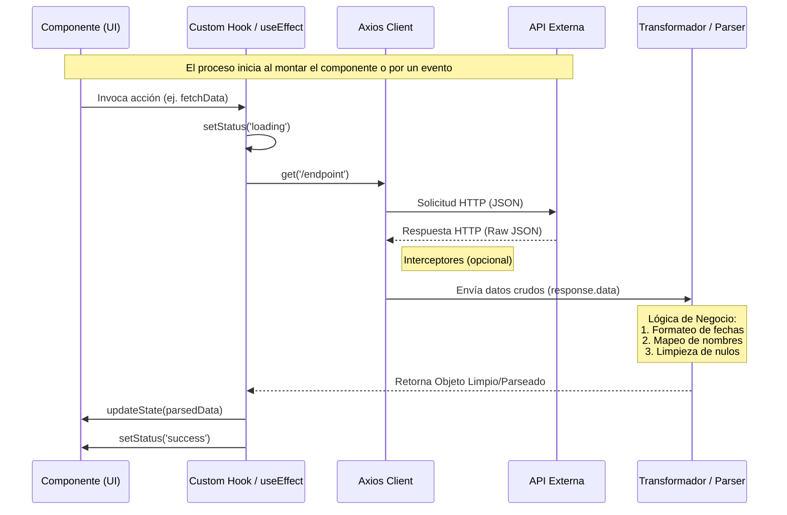
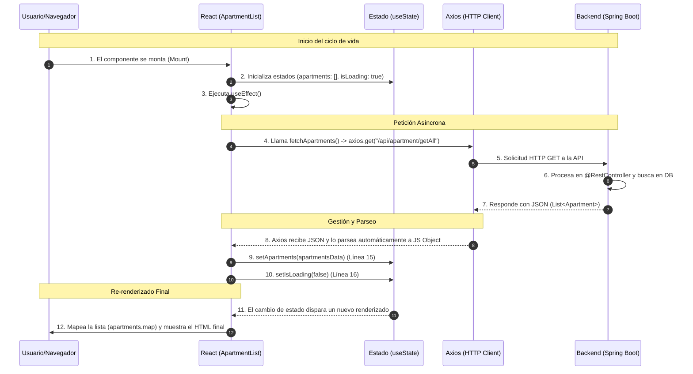

# Documentación de Gestión de Datos: Componente ApartmentList

Este documento detalla el flujo de información, desde la petición asíncrona hasta el renderizado final en el componente React, explicando cómo interactúan los Hooks y la librería Axios.

## 1. Diagrama Flujo de Datos en React



## 2. Diagrama de Secuencia Datos Apartment
El siguiente diagrama ilustra el ciclo de vida de los datos:



## 3. Explicación Detallada Paso a Paso

### 1. Inicialización y Montaje

Cuando el componente **`ApartmentList`** se carga, lo primero que ocurre es la inicialización de los Hooks.

* **Líneas 5–7**: Se definen los estados iniciales.
  `isLoading` comienza en `true`, por lo que el usuario ve el mensaje **"Loading..."** en la pantalla inicialmente.

---

### 2. Disparo del Efecto (`useEffect`)

* **Línea 9**: El `useEffect` con el array de dependencias vacío `[]` le indica a React:
  *"Ejecuta este código solo una vez, justo después de que el componente aparezca en pantalla"*.

* **Línea 10**: Se define y se llama inmediatamente a la función asíncrona `fetchApartments()`.

---

### 3. La Petición HTTP (Axios)

* **Línea 12**:

  ```js
  axios.get("/api/apartment/getAll")
  ```

  envía una solicitud al servidor Spring Boot.

> **Importante:** Axios realiza el parseo automáticamente cuando el backend responde con JSON.
> No es necesario usar `JSON.parse()`, ya que el resultado ya es un objeto de JavaScript accesible en `response.data`.

---

### 4. Gestión del Backend (Spring Boot)

Aunque no se muestra el código Java, el flujo asume que:

* Un **`@RestController`** recibe la petición en el endpoint correspondiente.
* Un **Repository** extrae los datos desde la base de datos.
* Spring Boot serializa los objetos Java a formato JSON mediante la librería **Jackson**.

---

### 5. Actualización del Estado y Re-renderizado

* **Línea 15**:

  ```js
  setApartments(apartmentsData)
  ```

  guarda los datos reales en el estado del componente.

* **Línea 16**:

  ```js
  setIsLoading(false)
  ```

  cambia el semáforo de carga.

**El trigger:**
En React, cada vez que se ejecuta un setter de estado (`set...`), el componente se vuelve a renderizar automáticamente.

---

### 6. Transformación de Datos a UI (`.map()`)

* **Línea 33**: Como `isLoading` ahora es `false`, React ejecuta el bloque de renderizado principal.

* **Línea 35**:

  ```js
  apartments.map(...)
  ```

  actúa como el motor de renderizado, recorriendo cada objeto del array y transformándolo en un elemento `<li>`.

* **Línea 36**:

  ```jsx
  key={apartment.id}
  ```

  permite que React identifique cada elemento de forma eficiente cuando la lista cambia.

---

### Un Punto Clave sobre el “Parseo”

En este código, el recorrido de los datos a través de distintos formatos es el siguiente:

**DB (SQL/NoSQL)** → **Java Object (POJO)** → **JSON (Texto)** → **JS Object** → **DOM (HTML)**

Este flujo garantiza una separación clara entre persistencia, lógica de negocio, transporte de datos y presentación en la UI.
