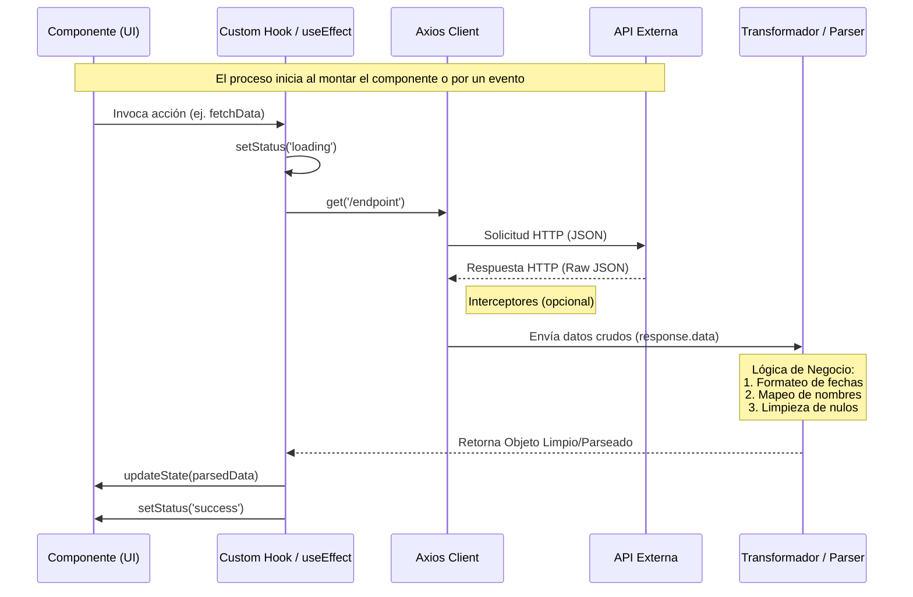
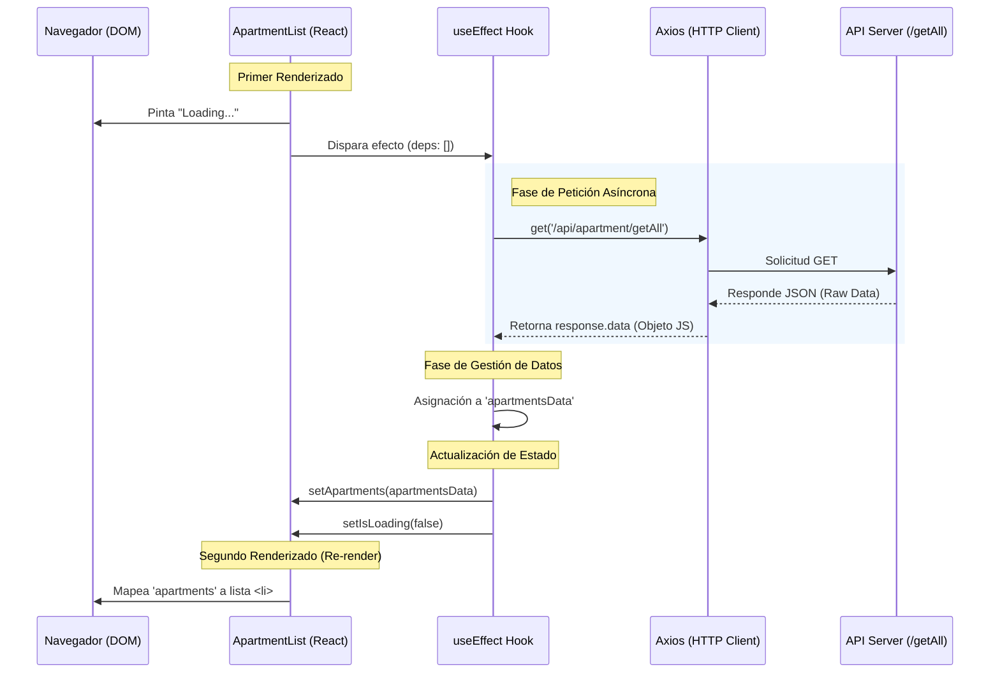

# Documentación de Gestión de Datos: Componente ApartmentList

Este documento detalla el flujo de información, desde la petición asíncrona hasta el renderizado final en el componente React, explicando cómo interactúan los Hooks y la librería Axios.

## 1. Diagrama Flujo de Datos en React


    Note over UI: Re-render con datos
---

## 2. Diagrama de Secuencia Datos Apartment
El siguiente diagrama ilustra el ciclo de vida de los datos:



## 3. Análisis Técnico del Flujo

### A. Inicialización del Estado (`useState`)

Se definen tres estados críticos para gestionar el ciclo de vida de la información:

* **`apartments`**: Inicializado como un array vacío `[]`. Es el contenedor final de los datos.
* **`isLoading`**: Un booleano que controla la experiencia de usuario (UX) mientras los datos viajan por la red.
* **`isAxiosError`**: Bandera para la gestión de excepciones.

---

### B. Disparador de Efecto (`useEffect`)

Al utilizar un array de dependencias vacío `[]`, el flujo de datos se inicia exactamente una vez inmediatamente después de que el componente se monta en el DOM.

---

### C. Consumo y Parseo Automático (Axios)

Cuando la API responde, Axios realiza el primer nivel de parseo de forma interna:

1. Recibe el cuerpo de la respuesta en formato de texto plano (JSON).
2. Lo transforma automáticamente en un Objeto Literal de JavaScript.
3. Lo entrega a la variable `response.data`.

---

### D. Transformación de Datos (Data Mapping)

En la línea:

```js
const apartmentsData = response.data;
```

los datos están listos para ser manipulados.

> **Nota:** En este punto es donde se recomienda aplicar funciones de limpieza o transformación si los nombres de las propiedades de la API (ej: `prefarea`) no coinciden con los nombres deseados para la UI (ej: `isPreferredArea`).

---

### E. Re-renderizado y Proyección

Al ejecutar `setApartments(apartmentsData)`, React detecta un cambio de estado y dispara un re-render. Durante este proceso:

* El componente vuelve a ejecutarse.
* La condición `{isLoading ? ... : ...}` cambia para mostrar la lista.
* El método `.map()` itera sobre el nuevo array de datos, proyectando cada objeto en un elemento `<li>` del DOM.
