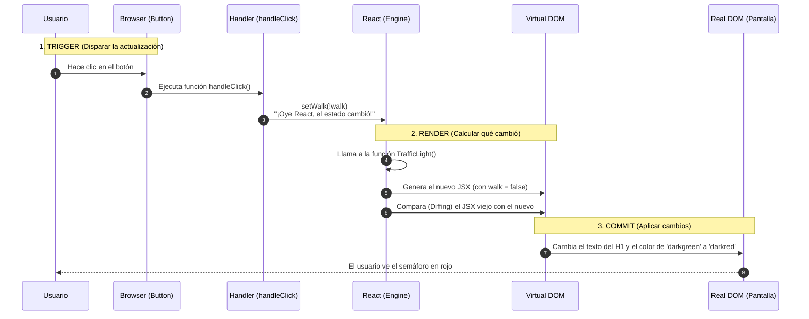

sequenceDiagram
    autonumber
    participant U as Usuario (Mouse)
    participant B as Botón (DOM)
    participant H as handleClick (Handler)
    participant R as React Hook Engine (useState)
    participant F as Fiber Tree (Estado: walk)
    participant V as Vista (UI / H1)

    Note over U, V: FASE 1: ESTADO INICIAL (walk = true)
    
    U->>B: Hace clic en el botón
    B->>H: Dispara evento onClick
    
    Note over H, R: FASE 2: EL MENSAJERO (Handler)
    H->>R: Llama a setWalk(!walk)
    Note right of H: Calcula el opuesto: si es true, envía false
    
    Note over R, F: FASE 3: EL MOTOR (Hooks & Fiber)
    R->>F: Consulta valor actual (true)
    F->>F: Compara con nuevo valor (false)
    Note over F: Diferencia detectada: Agenda Re-render
    
    Note over F, V: FASE 4: RE-RENDERIZACIÓN
    F->>V: Ejecuta TrafficLight() con walk = false
    V->>V: Evalúa ternario: walk ? 'darkgreen' : 'darkred'
    V-->>U: El H1 cambia de Verde a Rojo y el texto a "Parar"

