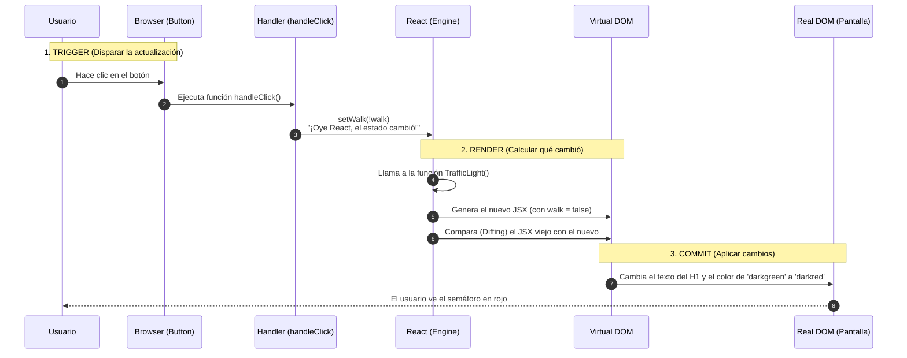

sequenceDiagram
    autonumber
    participant U as Usuario (Mouse)
    participant B as Botón (DOM)
    participant H as handleClick (Handler)
    participant R as React Hook Engine (useState)
    participant F as Fiber Tree (Estado: walk)
    participant V as Vista (UI / H1)

    Note over U, V: FASE 1: ESTADO INICIAL (walk = true)
    
    U->>B: Hace clic en el botón
    B->>H: Dispara evento onClick
    
    Note over H, R: FASE 2: EL MENSAJERO (Handler)
    H->>R: Llama a setWalk(!walk)
    Note right of H: Calcula el opuesto: si es true, envía false
    
    Note over R, F: FASE 3: EL MOTOR (Hooks & Fiber)
    R->>F: Consulta valor actual (true)
    F->>F: Compara con nuevo valor (false)
    Note over F: Diferencia detectada: Agenda Re-render
    
    Note over F, V: FASE 4: RE-RENDERIZACIÓN
    F->>V: Ejecuta TrafficLight() con walk = false
    V->>V: Evalúa ternario: walk ? 'darkgreen' : 'darkred'
    V-->>U: El H1 cambia de Verde a Rojo y el texto a "Parar"

## Análisis de las fases del ciclo de actualización en React

### 1. Trigger — El disparador
**Descripción:**  
Es el instante en el que se solicita un cambio en la interfaz.

**En tu código:**  
Sucede dentro de `handleClick` cuando se ejecuta `setWalk(!walk)`.

**Funcionamiento técnico:**  
React recibe la señal de que el estado `walk` ha sido modificado. Si el *setter* (`setWalk`) no se invoca, el disparador nunca se activa y la interfaz permanece sin cambios.

---

### 2. Render — El procesador
**Descripción:**  
React vuelve a ejecutar el componente para decidir qué debe mostrarse en pantalla.

**En tu código:**  
React ejecuta nuevamente `TrafficLight()`. En esta ejecución, el valor de `walk` ya no es `true`, sino `false`.

**Funcionamiento técnico:**  
React compara el resultado anterior con el nuevo y detecta las diferencias. Por ejemplo, identifica que el color debe cambiar de `darkgreen` a `darkred`.  
⚠️ En esta fase aún no se realizan cambios visibles en el navegador.

---

### 3. Commit — La entrega
**Descripción:**  
React aplica únicamente los cambios necesarios en el navegador.

**En tu código:**  
React indica al navegador que actualice solo el texto del `<h1>` y su propiedad `style`.

**Funcionamiento técnico:**  
React modifica el DOM real. Una vez completado este paso, el navegador repinta la interfaz (*paint*) y el usuario puede ver el cambio reflejado en pantalla.

---

### ¿Por qué es útil entender este flujo?

- **Handlers:** Existen en la fase de *Trigger*. Su función es capturar la acción del usuario.
- **Hooks (`useState`):** Funcionan como el enlace que transporta la información desde el *Trigger* hasta el *Render*.
- **JSX:** Es la plantilla que React evalúa durante el *Render* para saber qué debe aplicar en el *Commit*.

---