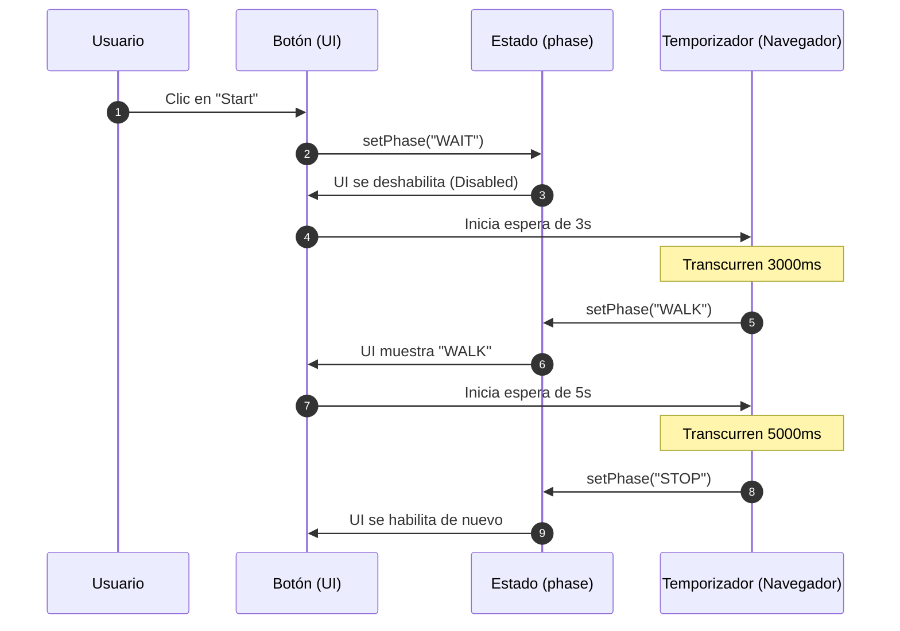
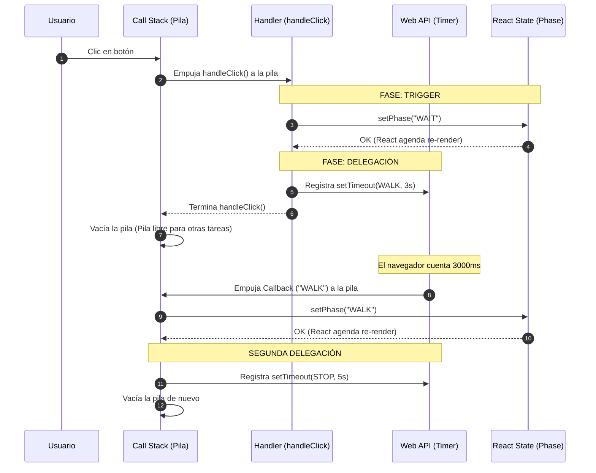
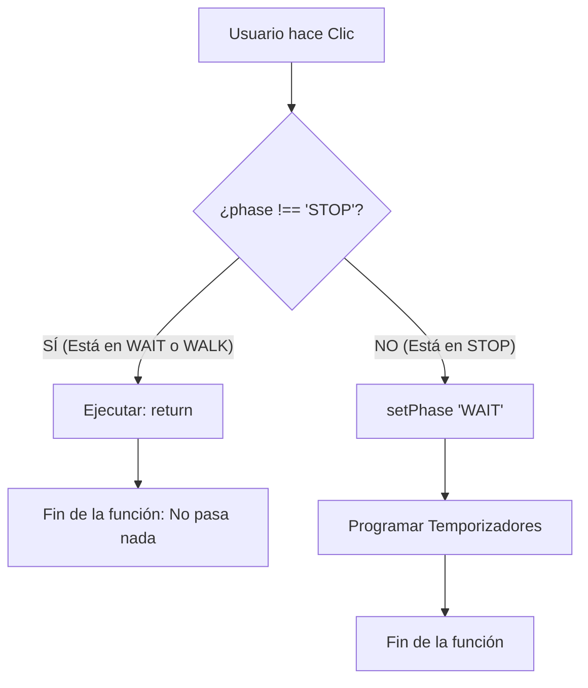

# Documentación del Componente TrafficLight (React)

## 1. Introducción

Este documento explica paso a paso el funcionamiento del componente **TrafficLight** en React.
El objetivo es entender cómo funciona el estado, los eventos y el renderizado en React usando un ejemplo sencillo: un semáforo para peatones.


---
### 1.1 Diagrama de Secuencia del Código



---

### 1.2 Diagrama de Secuencia: Handler y Pila de Memoria


---

## 2. Código completo

```js
import { useState, useRef } from "react";

export default function TrafficLight() {
  const [phase, setPhase] = useState("STOP");

  const durations = {
    STOP: 0,
    WAIT: 3000,
    WALK: 5000,
  };

  const handleClick = () => {
    if (phase !== "STOP") return;

    setPhase("WAIT");

    setTimeout(() => {
      setPhase("WALK");

      setTimeout(() => {
        setPhase("STOP");
      }, durations.WALK);
    }, durations.WAIT);
  };

  return (
    <>
      <h1>{phase}</h1>

      <button
        onClick={handleClick}
        disabled={phase !== "STOP"}
      >
        {phase !== "STOP" ? "Waiting..." : "Start / Next"}
      </button>
    </>
  );
}
```

---

## 3. Importaciones

```js
import { useState, useRef } from "react";
```

- **useState**: Hook de React que permite crear y manejar estado.
- **useRef**: No se utiliza en este código y puede eliminarse.

---

## 4. El componente React

```js
export default function TrafficLight() {
```

- Un componente en React es una función.
- Devuelve JSX (una mezcla de HTML y JavaScript).
- Se exporta para poder usarse en otros archivos.

---

## 5. Estado con useState

```js
const [phase, setPhase] = useState("STOP");
```

- **phase**: valor actual del estado.
- **setPhase**: función para cambiar el estado.
- **"STOP"**: valor inicial.

> En React el estado **nunca se modifica directamente**, siempre se usa la función setter.

---

## 6. Configuración de tiempos

```js
const durations = {
  STOP: 0,
  WAIT: 3000,
  WALK: 5000,
};
```

Objeto que define cuánto dura cada fase del semáforo en milisegundos.

---

## 7. Función handleClick

```js
const handleClick = () => {
```

Se ejecuta cuando el usuario pulsa el botón.

### 7.1 Validación

```js
if (phase !== "STOP") return;
```



Evita que el botón funcione si el semáforo no está en STOP.

---

### 7.2 Cambio de estado a WAIT

```js
setPhase("WAIT");
```

Actualiza el estado y React vuelve a renderizar la vista.

---

### 7.3 Temporizador WAIT → WALK

```js
setTimeout(() => {
  setPhase("WALK");
}, durations.WAIT);
```

Después de 3 segundos cambia a WALK.

---

### 7.4 Temporizador WALK → STOP

```js
setTimeout(() => {
  setPhase("STOP");
}, durations.WALK);
```

Después de 5 segundos vuelve a STOP.

---

## 8. Renderizado (JSX)

```jsx
<h1>{phase}</h1>
```

Muestra el estado actual. Cada cambio de estado actualiza el texto automáticamente.

---

## 9. Botón

```jsx
<button
  onClick={handleClick}
  disabled={phase !== "STOP"}
>
```

- **onClick**: ejecuta la función.
- **disabled**: desactiva el botón cuando no está en STOP.

---

## 10. Texto dinámico del botón

```jsx
{phase !== "STOP" ? "Waiting..." : "Start / Next"}
```

Uso del operador ternario:

```
condición ? valor_si_true : valor_si_false
```

---

## 11. Flujo completo del semáforo

```
STOP → WAIT → WALK → STOP
```

Todo se controla mediante estado y temporizadores.

---

## 12. Idea clave de React

1. El estado cambia
2. React vuelve a ejecutar el componente
3. La interfaz se actualiza automáticamente

> En React no se manipula el HTML directamente, se modifica el estado.

---

## 13. Conclusión

Este componente demuestra:
- Uso básico de `useState`
- Manejo de eventos
- Control del tiempo con `setTimeout`
- Renderizado dinámico

Es un ejemplo ideal para comenzar a entender React.